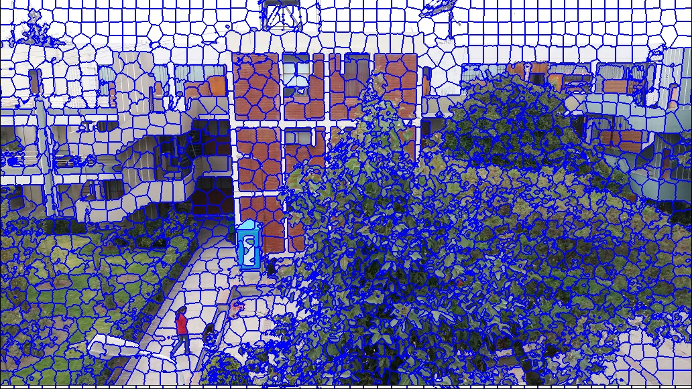

# Grafica2
# **Tópicos en computación Gráfica**
## Alumno:
Pancca Mamani, Israel Santiago
 
Escuela de Ciencia de la Computación

# **Replica del paper :  gSLICr: SLIC superpixels at over 250Hz**
El paper se basa en usa algoritmo de SUPERPIXEL que tiene la finalidad de agrupar pixeles


# Pre - procesamiento

Los códigos se encuentran en gSLICr_Lib/engines/gSLICr_seg_engine_GPU.cu
1. Insertamos una imagen 
2. La imagen ingresada en RGB convertimos a formato Cielab para ello usamos la siguiente función que dara una hebra por pixel 
``` 
__global__ void Cvt_Img_Space_device(const Vector4u* inimg, Vector4f* outimg, Vector2i img_size, COLOR_SPACE color_space);
```
3. Inicialización del centro de clúster: 

Utilizamos un hilo por cada centroide para poder inicializar el mapa de pixeles que van a clusterizar a los nodos que fue convertido por cielab
```
__global__ void Init_Cluster_Centers_device(const Vector4f* inimg, spixel_info* out_spixel, Vector2i map_size, Vector2i img_size, int spixel_size);
```
4. Buscar centro de asociation

Cada píxel de la imagen determina cuál es el clúster más cercano utilizando la distancia 5D. se utiliza 9 clusters
``` 
__global__ void Find_Center_Association_device(const Vector4f* inimg, const spixel_info* in_spixel_map, int* out_idx_img, Vector2i map_size, Vector2i img_size, int spixel_size, float weight, float max_xy_dist, float max_color_dist);
```
5. Actualización del centro del clúster:

Aquí se actualiza cada centro de clúster utilizando los píxeles asignados a él. Este proceso se realiza en dos Kernels separados. En primer lugar, cada centroide del clúster debe acceder a todos los píxeles asociados a él, dentro de un vecindario local que es una función del tamaño del superpixel.
```
__global__ void Update_Cluster_Center_device(const Vector4f* inimg, const int* in_idx_img, spixel_info* accum_map, Vector2i map_size, Vector2i img_size, int spixel_size, int no_blocks_per_line);
```
6. Aplicar la conectividad

Elimina los píxeles perdidos con dos llamadas de un hilo por píxel del mismo kernel. 
Después le asignamos una etiqueta a ese pixel para agruparlo con un cluster
```
__global__ void Enforce_Connectivity_device(const int* in_idx_img, int* out_idx_img, Vector2i img_size);
```
7. Mostramos los resultados 
```__global__ void Draw_Segmentation_Result_device(const int* idx_img, Vector4u* sourceimg, Vector4u* outimg, Vector2i img_size);
```


# Pruebas


